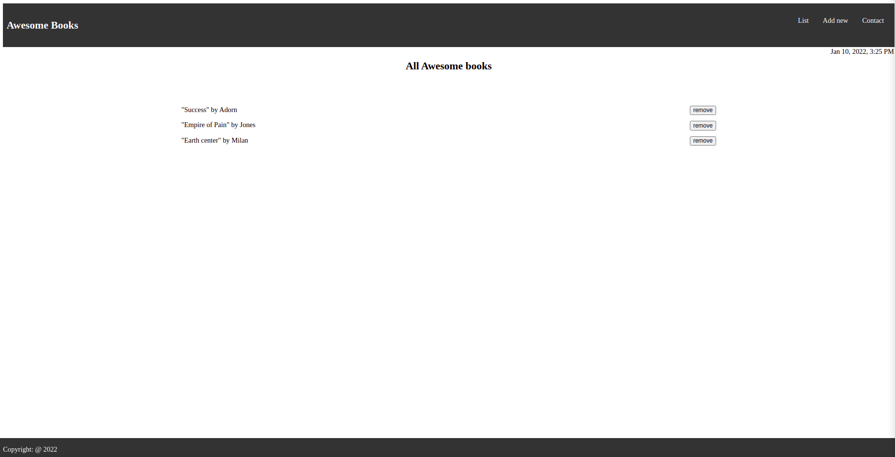

# awesome-books-es6

This project was done in a Javascript module I'm taking from Microverse in how to use Javascript objects, Javascript ES6 and DOM manipulation.

## Built With 
 - HTML
 - CSS
 - Javascript

## Getting started
to run the project locally, clone the project using the command 

`https://github.com/banlon-jones/awesome-books-es6.git `
navigate in to the project directory, from GitHub,
to test or run the application double click on the `index.html` file to open in your browser

### Live Demo
click on the link below to view the portfolio website online

https://banlon-jones.github.io/awesome-books-es6/
## Authors

 - Github: [banlon-jones](https://github.com/banlon-jones)
 - Github: [mprotic123](https://github.com/mprotic123)
 - GitHub: [@asanchy](https://github.com/Asanchy) 
 
## Acknowledgments

Thanks to the Microverse team with the structure of the project
